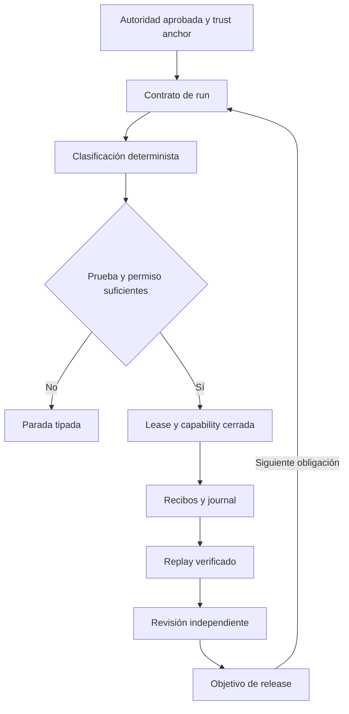

# Arquitectura propuesta — evolución compatible, sin plataforma nueva

Estado: **PROPOSED_NON_AUTHORITATIVE**. Requiere MIGRATION-01 del [informe](README.md). Ninguna política de esta carpeta está instalada ni gobierna el repo.

## Decisiones de diseño

1. Conservar instalador, auditor, Make, plantillas minimal/full y packs existentes. Reparar sus errores antes de ampliar autonomía.
2. Añadir un pack opcional `packs/autonomy/`, con runtime local, sin servicio, base de datos ni dependencia de CI. Node + YAML 1.2 + Zod quedan confinados al pack; la instalación legacy conserva Bash 3.2/Python. Versiones y lockfile se fijan durante H03; no se distribuyen dependencias flotantes.
3. Una sola implementación del pack y fixtures de aceptación contra la copia instalada. No duplicar una nueva plataforma en otro repositorio ni dispersar las decisiones por prompts.
4. Los comandos legacy siguen siendo un modo explícito de confianza, sin recibir retrospectivamente las garantías v2. El runtime nuevo sólo acepta capabilities registradas y ejecuta argv con `shell: false`.
5. La evidencia es una afirmación hasta validarse contra entradas, ejecución y autoridad. Un schema correcto prueba estructura; un hash prueba identidad de bytes; ninguno prueba autorización ni corrección de producto.

Alternativas evaluadas: reemplazo global del kit (incompatible y descartado); ampliar `eval` y el JSON actual (menor código inicial, pero no consigue contención ni replay); pack opt-in (recomendado, permite comparar versiones y rollback por consumidor).

## Fronteras y flujos

El runtime se separa en módulos pequeños: `identity` (parser y normalización), `authority` (bindings y grants), `classify` (pruebas y decisión), `journal` (eventos y replay), `workspace` (snapshot y lease), `commands` (capabilities/supervisión), `continuation` (remediación), `review` (adapter), `release` (objetivo). Estos nombres son interfaces propuestas, no archivos que ya existan.

## Authority flow y jerarquía

`authority_binding` contiene `source`, `version`, `sha256`, `precedence`, `semantic_role`, `repository_id` y `approval_receipt`. La precedencia forma un orden explícito aprobado; un conflicto no se resuelve por fecha, modelo, confianza verbal ni por el archivo que se leyó primero. Una dependencia cíclica bloquea.

Roles separados: `normative`, `derived`, `evidence`. Un derivado puede demostrar relación con su fuente, pero no reemplazarla. Las políticas se cargan de una baseline confiable ajena a las escrituras del agente; la copia que éste modifica es una propuesta. Cambiar el normalizador o el schema es cambio de significado del sistema de prueba y requiere versión y autorización nuevas.

Un owner escrito en YAML o `approved: true` no autoriza nada. El recibo de aprobación debe verificarse contra una identidad y un canal de aprobación confiables, ligado a artefacto, repo y alcance. El mecanismo concreto de identidad se configura al adoptar el pack; su ausencia produce `BLOCKED_BY_MISSING_AUTHORITY_BINDING`.

## Tres hashes, cuatro responsabilidades

| Campo | Cálculo | Gobierna | No permite |
|---|---|---|---|
| `content_sha256` | SHA-256 de bytes originales | Integridad, input exacto e historia | Inferir equivalencia de significado |
| `canonical_sha256` | SHA-256 de serialización canónica versionada | Reproducibilidad de la representación | Sustituir un hash normativo aprobado |
| `semantic_sha256` | SHA-256 de representación tipada validada + schema + normalizador + namespace del repo | Comparar semántica dentro de ese contrato | Omitir contenido, normalizar texto humano o ignorar campos sin regla aprobada |
| Recibo histórico | Referencias a los tres + parser/schema/runtime/input SHA + testigo | Qué se verificó y cuándo | Reescribir el pasado al recalcular derivados |

`canonical_sha256` y `semantic_sha256` pueden coincidir por construcción en un perfil sencillo; no se fuerza una diferencia artificial. Sus roles siguen siendo distintos. La comparación no depende sólo del hash: el verificador obtiene ambos árboles tipados y prueba la equivalencia con la misma versión del schema. Se preservan bytes originales incluso cuando el YAML se canoniza.

Perfil inicial seguro: YAML 1.2 restringido a valores compatibles con JSON, claves string únicas, orden de arrays preservado, strings byte-exact, números exactos sin redondeo. Rechazar documentos múltiples, tags custom, anchors/aliases/merge keys, claves duplicadas, claves no string, valores no finitos y datos fuera del schema. No implementar otro parser mediante regex. La distinción número/string/boolean se preserva; `100 → 99.9` nunca pasa. `1` frente a `1.0` sólo son equivalentes si el campo tiene una normalización numérica explícita. Renames, enum aliases y whitespace human-facing son semánticos por defecto.

El hash de una autoridad aprobada no se cambia sólo porque su representación equivalente tenga otro hash. Se conserva la autoridad original y se registra una representación derivada con su prueba. Cambiar el trust anchor, la precedencia o el contrato de equivalencia no es un `DERIVED_BINDING_UPDATE`.

## Clasificación y prueba

Cada solicitud se divide por artefacto/operación. Puede tener varias clases: el resultado de un batch es el más restrictivo, no la primera etiqueta favorable. Si el mismo diff reordena YAML y modifica un threshold, el batch requiere decisión semántica. Paths, extensiones y salida del LLM son pistas; nunca prueba de equivalencia.

La función propuesta `classifyChange(request, verifiedContext)` devuelve clases, disposición, reason code, hashes de pruebas e invariantes evaluadas. `verifiedContext` lo construye el runtime a partir de objetos leídos y verificados; no acepta una lista de booleanos que el agente declara verdaderos. El resultado `AUTONOMOUS_ELIGIBLE` autoriza sólo la capability exacta, no un shell ni un directorio de producto completo.

Dos rutas autónomas diferentes:

- **Equivalencia demostrable:** canonicalization y derivaciones cerradas. El output se recomputa desde inputs autorizados y debe coincidir byte por byte. Sólo entonces puede modificarse el binding derivado.
- **Remediación previamente autorizada:** código/fixtures/goldens dentro de un grant acotado. No se pretende demostrar equivalencia de programas arbitrarios con tests. Se comprueban límites del grant, invariantes normativas congeladas, regresión durable, cobertura/expectativas preservadas y revisión independiente. Una duda sobre impacto reabre el gate humano.

La segunda ruta no hereda autoridad de la primera. Esta distinción evita convertir «tests verdes» en una prueba general de identidad semántica.

## Desired state y journal

`desired_semantics` fija autoridad, AC, scope semántico, threat model, arquitectura, contratos y conjunto de obligaciones. `desired_representation` fija profile de parser/canonicalizer y artefactos canónicos. `desired_binding` fija commit, manifest del workspace, inputs/outputs y recibos actuales. La actualización del tercero nunca altera silenciosamente el primero.

Cada evento incluye versión, repo, run, número de secuencia, parent hash, operation key, inputs, outputs, actor, capability y resultado. Los objetos se guardan por contenido mediante creación exclusiva; fsync y publicación atómica donde lo permita el sistema. Un índice reparable es una proyección, no autoridad. Un tail incompleto después de un crash no se trunca en silencio: se conserva y se clasifica como `INCOMPLETE`.

`observed_state = replay(journal, trusted_checkpoint, immutable_inputs)` sólo existe después de verificar secuencia, hashes, identidad, transiciones, testigos y unicidad de operations. El mismo operation key y los mismos inputs devuelven el recibo existente; el mismo key con otros inputs es `POLICY`, no otro intento.

Hash chaining detecta alteraciones respecto de un checkpoint; por sí solo no evita que alguien con escritura sustituya o trunque toda la historia. La certificación fuerte requiere un testigo/checkpoint fuera del dominio de escritura del agente. Sin él, se informa la garantía más débil y no se afirma auditoría inmutable contra un actor malicioso del mismo usuario del sistema operativo.

### Stale run replacement

Un run no terminal stale recibe un evento terminal REJECTED con razón de frescura; un run ya terminal no cambia de veredicto. En este último caso, un evento de linaje nuevo lo marca superseded **para el objetivo actual**, sin editar su historia. El run nuevo referencia el anterior y liga el commit final.

Se exige identidad de autoridad, scope semántico, AC, threat model y arquitectura. La implementación de producto puede haber cambiado entre commits dentro del scope autorizado; eso no es equivalencia del producto anterior, y obliga a volver a verificar los outputs. Un recibo previo no se copia como PASS del nuevo commit. Un cambio en el contrato o en el permiso bloquea.

## Workspace y comandos

Allowlist exacta para writes y denylist con precedencia; regiones congeladas por hashes; rechazar symlinks, hardlinks a objetos protegidos, path traversal y escapes tras resolución. Comparar manifests antes/después, incluyendo archivos no tracked relevantes, modos y targets. Una mutación derivada esperada debe coincidir con output/path calculados por una capability registrada.

WIP=1 se implementa con lease exclusiva y fencing token; comprobarla antes de cada mutación, no sólo al iniciar. No recuperar un lease sólo porque venció el reloj: demostrar ausencia del owner o exigir recuperación autorizada. Crash, proceso hijo huérfano o token stale impiden seguir escribiendo.

El supervisor usa argv, env allowlisted, cwd fijado, límites de tiempo/output y terminación del grupo de procesos. Las capabilities no son nombres arbitrarios que invocan scripts cambiados por el agente. Binario, script y dependencias quedan ligados a versiones confiables. Las credenciales del reviewer/deploy no llegan a capas de producto no confiables.

## Human gate continuation y presupuestos

El approval original de un golden sigue atado a sus bytes. Un grant separado puede permitir regenerarlo y continuar cuando coinciden AC, autoridad, scope, threat, arquitectura, clase de defecto y regla infringida. Debe incluir defect ID, paths, acciones, límites, expiración/revocación y regresión requerida. No aceptar un golden nuevo sólo porque exista un approval antiguo. `continue_to_next_slice` permite escoger una slice ya autorizada del mismo objetivo; no ampliar el backlog aprobado.

Presupuestos separados: `product_semantic_review`, `harness_implementation_review`, `mechanical_verification`, más un techo total por objetivo y control de bloqueo repetido. Todos se configuran en la autoridad aprobada. Canonicalization no gasta revisión semántica, pero sí recursos verificables. Rebind/fresh run no reinicia contadores ni revive grants revocados. No se inventan límites numéricos en este diseño.

## Reviewer Codex

Único adapter propuesto: OpenAI + cuenta ChatGPT + Codex. Resolver capabilities al iniciar y congelar binario, protocolo, modelo, effort, schema, config y auth mode para todo el run. El catálogo de modelos puede descubrir disponibilidad, pero no prueba una escala universal de capacidad. Se usa un orden aprobado de capacidad entre modelos compatibles; ausencia o ambigüedad produce diagnóstico técnico, nunca fallback silencioso a otro proveedor/modelo.

Usar proceso y sesión independientes; shadow Git reproducible desde el commit/manifest objetivo, sin heredar hooks, remotes con credenciales, config local de producto ni instrucciones adicionales que amplíen permisos. Mantener los requisitos de trust y el sandbox read-only; no usar `--skip-git-repo-check` como reparación. El workspace primario debe permanecer idéntico al final. Read-only del filesystem no impide por sí solo requests de red o MCP: limitar también esas capabilities.

Aislar config en un directorio propio del run mediante la interfaz soportada por la versión fijada. Nunca mutar el home/config global ni copiar indiscriminadamente secretos. Si el mecanismo de aislamiento cambia el acceso al login, resolverlo en preflight con el canal autorizado; no convertirlo en cambio de autenticación.

Primero pedir output estructurado si el adapter lo soporta. Sólo ante incompatibilidad de **transporte/schema soportado**, permitir respuesta sin schema remoto y validarla con el mismo Zod local estricto. Output inválido, truncado, extra fields, verdict inventado o schema local cambiado bloquean. El fallback no elimina probes, evidencia ni revisión. Codex exit 0 y el campo `PASS` del reviewer no certifican el contrato; el runtime reproduce los contraejemplos y valida los recibos.

Las capacidades `codex exec`, `--output-schema`, reutilización de login y Git requerido constan en la [documentación oficial de ejecución](https://developers.openai.com/codex/noninteractive); los modos de login están en [autenticación](https://developers.openai.com/codex/auth). `model/list` y capabilities se describen en [App Server](https://developers.openai.com/codex/app-server). Son referencias de diseño consultadas el 2026-09-05; la compatibilidad real debe probarse en H07 con el binario elegido. No se probó aquí una llamada real a Codex.

## Release y recuperación

El objetivo declara componentes, slices, branch integrada, gates humanos, target, deploy y smoke/certificación. El scheduler calcula la siguiente obligación pendiente a partir del replay. `SLICE_PASS`, PR merged o preview PASS no son terminales si el objetivo es `PRODUCTION_PASS`.

La integración invalida evidencia que sólo cubría la branch anterior: verificar el commit resultante. Deployment tiene identificador y digest del artefacto; smoke y observabilidad deben apuntar a ese deployment. Un rollback también tiene operación, identidad, permiso y evidencia. Un fallo post-deploy no reescribe éxito histórico: produce un incidente y bloquea el objetivo hasta recuperación certificada.

La publicación del propio kit y el deployment de un producto son objetivos diferentes. Para `harness-kit`, GitHub Release no demuestra adopción correcta en un consumidor. H09 exige un canario de instalación y reejecución; para productos, cada owner configura la producción y sus gates. Esta revisión no autoriza despliegues de Aurobalance ni otros clientes.
