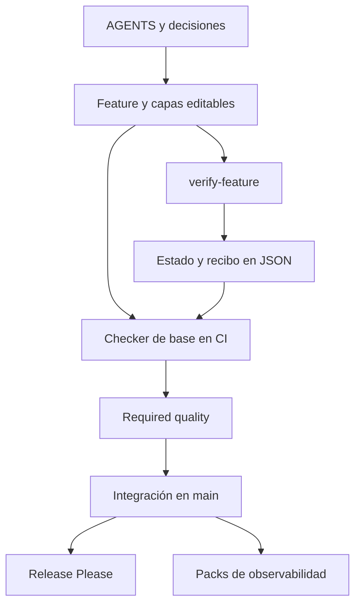

# Harness hardening y reducción de fricción de autonomía

Fecha: 2026-09-05. Repositorio: `gonzalezulises/harness-kit`.
Base auditada: [`88ea1e6c45faf5b5db9e29935eef6e25e50f633b`](https://github.com/gonzalezulises/harness-kit/tree/88ea1e6c45faf5b5db9e29935eef6e25e50f633b).
Estado de ejecución: **HARNESS_REVIEW_BLOCKED**. Esta entrega contiene diagnóstico, diseño propuesto, políticas inactivas y regresiones RED; no activa un motor de autonomía, no modifica las garantías de producción y no acepta una baseline.

## Dictamen

La prioridad es corregir las falsas garantías antes de ampliar la autonomía. El kit tiene fortalezas que conviene conservar: instalación portable, controles locales, comprobación de claims desde la base de GitHub, sentinels de ejecución en CI, matrices que prueban fallos reales y disciplina de evidencia. Sin embargo, varios verificadores convierten errores o información incompleta en éxito. Un presupuesto agotado tampoco impide una nueva ejecución.

La premisa arquitectónica que necesita una decisión es concreta: **M01–M04 no están implementados en este `main`**. `feature_list.json` es estado mutable y `.harness/traces/traces.jsonl` es telemetría; ninguno es un journal verificable que gobierne el estado. Por tanto, el requisito `observed_state = verified journal replay` requiere introducir un modelo de autoridad nuevo y decidir cómo convive con los catorce claims históricos. No se puede presentar esa operación como un rebind mecánico de algo que ya existe.

La recomendación es evolucionar el kit con un pack opcional de ejecución local, preservar el modo legacy y convertir `feature_list.json` en proyección únicamente en repositorios que adopten explícitamente el nuevo modo. Los registros históricos se importan como `LEGACY_UNVERIFIED`; conservar un archivo no demuestra que sus antiguas verificaciones se ejecutaron sobre un snapshot íntegro. Una nueva verificación puede producir evidencia nueva sin borrar la anterior.

## Entregables y alcance

| Entregable solicitado | Ubicación |
|---|---|
| Mapa actual, fricciones y brechas | Este informe |
| Arquitectura propuesta | [architecture.md](architecture.md) |
| Migración por milestones | [migration-plan.md](migration-plan.md) |
| Política de autonomía | [autonomy-policy.v1.yaml](policies/autonomy-policy.v1.yaml) |
| Política mecánica | [mechanical-change-policy.v1.yaml](policies/mechanical-change-policy.v1.yaml) |
| Política de ejecución de release | [release-execution-policy.v1.yaml](policies/release-execution-policy.v1.yaml) |
| Taxonomía formal | [stop-taxonomy.v1.yaml](policies/stop-taxonomy.v1.yaml) y [semántica de estados](stop-taxonomy.md) |
| Schemas de políticas y registros | [schemas](schemas/) |
| Matriz histórica y adversarial | [test-matrix.md](test-matrix.md) |
| Evidencia reproducible y revisión independiente | [evidence](evidence/) y [regresiones](red_regressions.py) |
| Requerimiento original | [requirements-original.md](requirements-original.md) |

Se inventariaron los 178 archivos de la base (157 blobs únicos; 924.441 bytes), incluidos scripts, plantillas, cuatro packs, workflows, estado y decisiones. Se verificaron los hashes Git de todos los blobs y del árbol; el checkout local es shallow en el SHA exacto. La historia reciente se consultó también mediante GitHub. El dibujo editable y su PDF son documentación, no evidencia de un runtime.

El alcance cubre este repositorio y sus controles GitHub visibles. No se auditó el código de Aurobalance ni se importaron decisiones de Casabat. Los incidentes M01–M04 del requerimiento se tratan como criterios de aceptación futuros; no como pruebas ejecutadas aquí.

## 1. Arquitectura actual

| Componente | Responsabilidad y ejecución real | Autoridad/evidencia | Límite relevante |
|---|---|---|---|
| `bin/harness-init.sh` | Renderiza minimal/full, detecta comandos, no sobreescribe salvo `--force` | Plantillas del kit | Actualización por copia; no migrador semántico ni transacción |
| `bin/harness-activate.sh` | Una confirmación o `--yes`, instalación y protección cuando existe acceso | Herramientas locales y GitHub | Ya reduce permisos repetitivos; no es un orquestador de releases |
| `bin/harness-audit.sh` | Auditor estructural con denominador estable | Presencia de archivos y patrones | Un score alto no prueba cumplimiento efectivo |
| `bin/harness-protect.sh`, `harness-status.sh` | Configuran/consultan protección remota | Rulesets | El status infiere demasiado de nombres; no equivale a un canario adversarial |
| `AGENTS.md`, `PROGRESS.md`, `feature_list.json` | Contrato, continuidad, backlog y estado | Markdown y JSON editables | No hay autoridad criptográfica ni replay del estado |
| `scripts/verify-feature.sh` | Ejecuta capas por `eval`, consume presupuesto y escribe `passing` | Texto de evidencia con SHA corto y fecha | Sin snapshot completo, lease, validación de estado ni recibo inmutable |
| `scripts/verify-claims.sh` | Reejecuta claims; cachea comandos idénticos; compara capas con base | Checker tomado de base en CI, comandos tomados de head | Misma cadena no implica mismo estado; el contrato también puede cambiar |
| `scripts/run-gates.sh` | Registro quick/full y estados de salida | `PASS` es único resultado aceptable | Clasifica códigos, pero no corrige scripts que retornan cero incorrectamente |
| Oracles/context/decisions/arch/delivery | Falsificación declarada, citas, ledger, reglas y runbook | Documentos y Git | Lectores heterogéneos; verifican propiedades distintas, no significado general |
| `scripts/session-trace.sh` | Añade líneas a archivo JSONL ignorado por Git | Telemetría con SHA corto | Sin cadenas de hashes, testigos, idempotencia o replay verificado |
| `tests/run-tests.sh` | Scaffolds y pruebas contra scripts reales | 273 aserciones del núcleo | Una fixture usa `/tmp/csc-backup.sh`; varias garantías se prueban sólo en fixtures |
| `packs/gherkin` | Valida mensajes de Cucumber | Conteo y estados de steps | No demuestra que la especificación sea correcta |
| `packs/load-testing` | k6, guard de contenido, resolución de target, rendimiento | Métricas y contadores | Algunas rutas autenticadas se simulan; espera y disponibilidad son acoplamientos |
| `packs/sentry` | Canary, salud de release, cron y candidatos de issues | Ingest + consulta de evento almacenado | Es observabilidad; no certificación integral del producto |
| `packs/openai-advanced` | Documentos y SOPs | Guías | No contiene adapter Codex ni reviewer ejecutable |
| `required-quality.yml` | Head/base exactos, verificaciones y sentinels | Resultado de GitHub Actions | No ejecuta el registro quick sobre la configuración viva del repo |
| `release-please.yml` | PR/versionado/changelog y GitHub Release | Manifest y sincronización derivada | No hay objetivo con componentes, gates humanos y `PRODUCTION_PASS` |

### Flujos actuales

- **Estado:** contrato `not_started → active → passing`; el ejecutor también escribe `blocked`, pero no verifica esa transición antes de correr. La comprobación WIP del ratio no es un lock de ejecución.
- **Autoridad:** documentos y capas del JSON; checker de claims y decisiones tomado de base en CI. El resto de la cadena no se convierte automáticamente en autoridad protegida.
- **Evidencia:** cadenas dentro del JSON, trazas, logs, informes de packs y GitHub summaries. No existe un ledger único de operaciones con dirección por contenido.
- **Ejecución:** agente → shell/Make → scripts → shell de capas. No hay registro de capacidades cerrado, manifiesto de efectos, regiones congeladas o supervisor común.
- **Revisión:** CI independiente del proceso local sí; actor/session reviewer read-only, adversarial reproduction y protocolo de dictamen M04 no.
- **Release:** comprobación → integración → Release Please. No hay relación determinista entre PASS de slice, commit integrado, despliegue y certificación posterior.

## 2. Hallazgos: fricción y seguridad

Severidad High significa que un control puede producir éxito indebido o ejecutar algo fuera de lo declarado en una fixture reproducible. No significa que se haya demostrado una intrusión remota. No se demostró ningún Critical. Se distinguen hallazgos ejecutados de riesgos de diseño.

| ID | Severidad / evidencia | Hallazgo y efecto | Clase de fricción |
|---|---|---|---|
| R01 | High, reproducido independiente | `verify-feature`: tras agotar presupuesto (`1 → 3`), una tercera corrida del mismo comando puede ejecutar, escribir `passing` y borrar el ledger (`0`) | necessary safety stop ausente |
| R02 | High, reproducido independiente | Campo `cmd` vacío se desplaza al leer TSV; se ejecuta `repair` y se promueve la feature | architecture debt / safety |
| R03 | High, reproducido independiente | JSON inválido o error de schema parcial en `verify-claims` deja salida vacía/parcial; retorna `NO_CLAIMS` o revalidación parcial con exit 0 | architecture debt / safety |
| R04 | High, reproducido independiente | `CLAIMS_BASE_FILE` explícito pero ausente desactiva comparación de capas y acepta una verificación debilitada | operational coupling / safety |
| R05 | High, reproducido independiente | Cache por texto: `test -f ready`, `rm ready`, `test -f ready` reutiliza el primer verde aunque el tercero falla ejecutado directamente | architecture debt / stale evidence |
| R06 | High, reproducido independiente | Ref inválida o base de decisiones ausente se reporta `NO_LEDGER`, exit 0, aun con decisión alterada | operational coupling / safety |
| R07 | High, reproducido independiente | `diff -b -B` permite alterar indentación de código normativo: un deploy sale de `if owner_approved` sin que el ledger lo detecte | semantic bypass disfrazado de mecánico |
| R08 | High, reproducido local | `check-arch`: `eval ... || true` borra el exit; una regla `expect: exit0` con `false` pasa | architecture debt / safety |
| R09 | High, reproducido local | `check-arch`: raíz JSON lista produce traceback y luego `0 architecture rules hold`, exit 0 | architecture debt / safety |
| R10 | High, lectura de workflow | `make check` ejecuta suites de fixtures; `required-quality` no ejecuta el registro quick sobre las políticas vivas. Probar el verificador no es aplicar ese verificador al repo | integration/test debt |
| R11 | Medium, reproducido | Full scaffold exige `verify-version-sync.sh`, que no está en el template ni se copia. El registro lo marca required; la decisión histórica lo limitaba al kit | unnecessary governance friction |
| R12 | Medium, reproducido independiente | Cambiar sólo `repair` dispara WEAKENED_VERIFICATION aun con `cmd` idéntico. El remedio anunciado active→verify→claims acaba en `0,0,5`: el chequeo sigue comparando contra la antigua base | unnecessary governance friction |
| R13 | Medium, reproducido independiente | Promoción directa desde not_started, dos active simultáneas e IDs duplicados no se validan al ejecutar; el primer ID puede promover ambos registros | architecture debt |
| R14 | Medium, lectura de fuente | `/tmp/csc-backup.sh` compartido entre suites: overwrite/cleanup concurrente. El resto del test ya dispone de `$WORK` | test debt |
| R15 | Medium, lectura de fuente | Hook formatea workspace y `git add` completo; puede incluir cambios no staged. Un formatter fallido tampoco fija necesariamente `fail=1` | mechanical mutation / operational coupling |
| R16 | Medium, lectura de fuente | El lector de oracles es un subconjunto artesanal de YAML, no un validador de equivalencia. Duplicados, tipos, multiline y tags no tienen un contrato estándar | architecture debt |
| R17 | Medium, lectura de fuente | `verify-oracles` contrasta historia de commits, no bytes de cambios todavía no commiteados. Citar un SHA no acredita que hubo RED | test/evidence debt |
| R18 | Medium, lectura de fuente | `context-routes` usa diff base..HEAD; omite cambios locales/staged al inicio. Las rutas de ejemplo para negocio apuntan a documentación ajena al kit | governance friction / stale routing |
| R19 | Medium, lectura de fuente | `harness-status` infiere READY_* por presencia/nombres y no ejecuta las comprobaciones locales ni valida íntegra la protección | operational coupling |
| R20 | Medium, lectura de fuente | `PROGRESS` informa v2.2.0 y pasos ya resueltos; VERSION es 2.2.5. Quality document sigue siendo una plantilla, bin/ARCHITECTURE habla de dos ejecutables aunque hay cinco | documentation debt |
| R21 | Medium, lectura de fuente | Baseline exige bash/Python, pero la suite completa necesita además Node y k6. `init.sh` corre sólo núcleo, por lo que su PASS no significa `make check` PASS | operational coupling |
| R22 | Medium, lectura de fuente | `perf-resolve-target` no propaga el fallo de la consulta de statuses dentro del bucle; puede terminar como ausencia de preview | operational coupling / evidence debt |

Referencias de línea, hashes y salidas de los siete High independientes: [independent-review.md](evidence/independent-review.md). Los R08–R11 se complementan en [local-probes.json](evidence/local-probes.json). R10 es una carencia demostrable por lectura del flujo, no una ejecución adversarial contra GitHub en este turno. Los hallazgos de lectura no se anuncian como defectos reproducidos.

### Paradas que deben conservarse

Autoridad nueva o conflictiva, semántica clínica/dominio, fórmulas, thresholds, pesos, scoring, expansión de scope, cambio de threat model, contrato de verificación más débil, arquitectura no aprobada, seguridad/datos, sign-off expresamente humano y baseline final. También debe bloquear la falta de evidencia o de capacidades; esta última puede permitir recuperación técnica preautorizada, pero nunca convertirse en PASS por agotamiento de retries.

### Fricción innecesaria que sí debe eliminarse

Cambiar bindings derivados tras una transformación determinista, canonizar YAML equivalente bajo schema fijo, reemplazar un run stale conservándolo, repetir un review dentro de una autorización acotada, registrar evidencia append-only y estabilizar fixtures sin alterar expectativas. En particular, el fallo de adapter se clasifica antes de gastar presupuesto semántico. **Una etiqueta `HARNESS_STABILITY` puesta por el implementador no demuestra esas invariantes.**

## 3. Brechas contra el requerimiento

| Requisito | Actual | Evolución necesaria |
|---|---|---|
| Classifier semántico/mecánico | Ausente | Resultado estructurado, composición restrictiva de cambios, UNKNOWN bloqueante |
| Identidad content/canonical/semantic | Ausente | Parser/schema/normalizador versionados y triple identidad con roles separados |
| Authority binding explícito | Parcial, documentos/base CI | Fuente/version/SHA/precedencia/rol, namespace del repo, owner y trust anchor |
| Desired semantics/representation/binding | Ausente | Tres objetos ligados; el rebind no modifica desired semantics |
| Append-only journal y replay | Ausente | Nuevo runtime, hash chain, secuencia, witnesses y reconstrucción |
| Fresh run replacement | Ausente | Rechazo terminal append-only, enlace supersedes y nueva verificación del commit final |
| Bounded remediation / golden | Ausente | Grant persistente y acotado; clase de defecto/regla/AC/regresión verificadas |
| Human gate continuation | Ausente | Grant de continuación separado del hash exacto aprobado; no aprobación retroactiva |
| WIP/lease/frozen/allowlists | WIP declarativo y checks | Control de efectos real, exclusión concurrente y contención de paths |
| Reviewer independiente | Checker CI parcial | Proceso/session separado, shadow Git, adapter fijo, output no confiable |
| Codex capability/model binding | Ausente | Preflight sin mutación global, modelo/adapter/schema congelados por run |
| Zod local fallback | Ausente | Pack opcional con validador local fijado; fallback de transporte, sin relajar contrato |
| Review budget diferenciado | Un contador por fallo de capa | Tres presupuestos + total de operación; no reset por rebind |
| Release objective continuity | Release Please parcial | Estado por objetivo/componentes, commit integrado y deployment concreto |
| Post-deploy certification | Sentry parcial | Smoke funcional y evidencia ligada al deployment, más observabilidad |
| TDD adversarial | Matrices existentes fuertes, cobertura incompleta | Regresiones de esta revisión + 12 escenarios históricos con execution gate |
| No permisos nuevos por housekeeping | Activación --yes ya existe | Capabilities de reparación cerradas y contrato firmado/aprobado fuera del agente |

## 4. Verificación y límites

- `./init.sh`: **273 passed, 0 failed**.
- `make gates` (quick): **8 PASS**, pero varios son vacuamente aplicables (no oracles/runbook) y el cuadro anterior prueba bypasses fuera de su suite.
- Primer `make check`: bloqueó correctamente por falta de k6 en el entorno.
- Con k6 **v2.1.0**, fijado por el repo: `make check` exit **0**; núcleo **273**, Gherkin **15**, load **55**, Sentry **68**: **411 aserciones aprobadas, 2 casos load omitidos** por ausencia de `gh` autenticado. Omitido no significa PASS.
- No se ejecutó una sesión de reviewer Codex CLI ni un despliegue de producto. No hay binary Codex/configuración autorizada de ese adapter en este checkout.
- GitHub: ruleset `20874477` activo, `Required quality` estricto y cero bypass actors en ese ruleset; no hay required approving reviews. La lista consultada no contiene un ruleset de integridad de workflow. Esto respalda un estado parcial, no la afirmación de protección completa.
- El último run de `Release` sobre la base auditada terminó success. No se confunde con una certificación de producto ni con un run de Required quality sobre esta nueva revisión.

Las suites históricas verdes y las regresiones nuevas RED son compatibles: las primeras prueban la cobertura que ya existía; las segundas descubren propiedades que esa cobertura no exigía. No se marcará una feature `passing` por haber redactado el diseño.

## 5. Decisión mínima requerida

**MIGRATION-01 — aprobar o rechazar esta arquitectura de transición:** mantener v1 portable y sus archivos históricos; incorporar un pack v2 opcional local dentro de `harness-kit`; en repos v2, usar replay como fuente de estado, `feature_list.json` como proyección y `LEGACY_UNVERIFIED` para evidencia anterior hasta revalidación. La adopción no puede hacerse con `--force`, no retrovalida recibos, no habilita deployment y no acepta la baseline final.

Se recomienda aprobar esa transición. Sus contratos y rollback están desarrollados en los documentos enlazados. La alternativa de sustituir globalmente el JSON rompería consumidores; la de llamar journal al JSON actual conservaría una falsa garantía. Una alternativa legítima es aportar el runtime probado de Aurobalance para evaluar una extracción del pack antes de implementarlo, pero no se presupone que sea portable ni que sus permisos de producto sean aplicables aquí.

El bloqueo se origina en la sección **Ejecución** del requerimiento del usuario: ante contradicciones importantes o riesgo de incompatibilidad, emitir HARNESS_REVIEW_BLOCKED. No es una exigencia de confirmación por cada milestone. Tras resolver MIGRATION-01, el plan encadena milestones verdes y revisados sin nuevas consultas por housekeeping. Todo cambio semántico nuevo conserva su gate.
